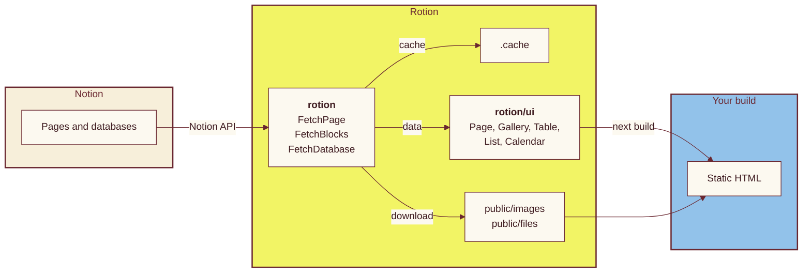

import {
  Action,
  Actions,
  Hero,
  Landing,
  Lede,
  Section,
  Way,
  Ways,
  Tile,
  Wall
} from '@/app/_components/landing.jsx'

<Landing>

<Hero
  lead="Your Notion "
  words={['pages', 'galleries', 'tables', 'lists', 'calendars']}
  trail=", "
  line2="as a website."
  labels={{ region: 'A Notion page and database drawn by Rotion', tablist: 'Component', page: 'Page', gallery: 'Gallery', table: 'Table', list: 'List', calendar: 'Calendar' }}
>
  <Lede>
    Rotion draws Notion pages and databases with React components. Galleries,
    tables, calendars and every kind of block come styled and ready, and the
    site builds to plain static HTML. Everything below was fetched from Notion
    and drawn by Rotion when this page was built.
  </Lede>
  <Actions>
  <Action href="/getting-started" primary>Get started</Action>
  <Action href="/blocks">Browse all blocks</Action>
  </Actions>
</Hero>

<Section
  band="sky"
  title="Every block, drawn the way Notion shows it"
  lede="Each tile is cut from a real Notion page. Open one to see the whole page and how Rotion renders it."
>

<Wall>
  <Tile id="93997cee371044c2936bb4e911764cd2" from={1} to={4} name="Headings" href="/blocks/headings" />
  <Tile id="38d8251cd03a45bf91613e2ef8a82c48" from={1} to={2} name="Callout" href="/blocks/callout" />
  <Tile id="f882184561d44eed89769bbfb867a6c7" from={1} to={2} name="Image" href="/blocks/image" />
  <Tile id="4d438f5ea4fa43f282153040fe7e1ff5" from={1} to={5} name="To do" href="/blocks/to-do" />
  <Tile id="72fb9fd9ff5247efbe6af4cf151562f5" from={1} to={3} name="Code" href="/blocks/code" />
  <Tile id="348bc8ba092945028865663e981038a9" from={1} to={2} name="Bookmark" href="/blocks/bookmarks" />
  <Tile id="a2af31d8e7254a17883fb6100d7d074a" from={1} to={3} name="Table" href="/blocks/table" />
  <Tile id="038f54d55b684bb0b02f3765dec8f4a9" from={0} to={1} name="Toggle" href="/blocks/toggle" />
  <Tile id="314fffb219c74ffab1e38b890a0de908" from={1} to={2} name="Quote" href="/blocks/quote" />
  <Tile id="1f8ab7d4c3474251b91f04ff70184a2d" from={1} to={2} name="Equation" href="/blocks/equation" />
</Wall>

</Section>

<Section
  title="Make it look like your site"
  lede="The components come styled, and every part of that styling can be changed. There are four ways to do it."
>

<Ways>

<Way title="Set the custom properties">

Colors, fonts, borders, corners and the gallery's columns are `--rotion-*` custom properties. Set them on `:root`, or on a wrapper to style one part of the site.

```css
.blog {
  --rotion-font-family: 'Inter', sans-serif;
  --rotion-primary-text: #3d1a1f;
  --rotion-border-radius: 12px;
  --rotion-gallery-grid-template-columns-medium: repeat(3, 1fr);
}
```

</Way>

<Way title="Style any element by its class">

Every element the components render has a class name starting with `rotion-`, so plain CSS reaches whatever the properties do not.

```css
.rotion-gallery-card:hover {
  transform: translateY(-2px);
}

.rotion-text-h1 {
  font-family: 'Fraunces', serif;
}
```

</Way>

<Way title="Choose how dark mode works">

`rotion/style.css` follows the operating system's setting. Import `rotion/style-without-dark.css` instead to switch themes your own way.

```ts
// Follows prefers-color-scheme
import 'rotion/style.css'

// Or leave dark mode to your site
import 'rotion/style-without-dark.css'
```

</Way>

<Way title="Decide what each view shows">

Props and options choose the properties to show, where each row links, the size of the cards and more.

```tsx
<Gallery
  db={db}
  keys={['Name', 'Tags']}
  options={{
    href: { Name: '/people/[id]' },
    image: { size: 'large', fit: false },
  }}
/>
```

</Way>

</Ways>

<Actions>
  <Action href="/components#theming">Theming reference</Action>
  <Action href="/database-views">Database view options</Action>
</Actions>

</Section>

<Section
  title="From a Notion page to HTML"
  lede="Fetch the page, fetch its blocks, and hand them to the Page component. Images and files are downloaded next to your site, so nothing you publish points back to Notion."
>



<p className="lp-caption">The arrows show which way the data flows.</p>

</Section>

<Section
  band="footer"
  title="Install and render a page"
  lede="Install the package, set NOTION_TOKEN, and a Notion page is a few lines of code away."
>

<div className="lp-stack">

```sh
npm install rotion
```

```tsx filename="app/page.tsx"
import { FetchBlocks, FetchPage } from 'rotion'
import { Page } from 'rotion/ui'

const id = process.env.NOTION_PAGE_ID!

export default async function Home() {
  const page = await FetchPage({
    page_id: id,
    last_edited_time: 'force',
  })
  const blocks = await FetchBlocks({
    block_id: id,
    last_edited_time: page.last_edited_time,
  })
  return <Page blocks={blocks} />
}
```

<Actions>
  <Action href="/getting-started" primary>Quick start</Action>
  <Action href="/introduction">How Rotion works</Action>
</Actions>

</div>

</Section>

</Landing>
