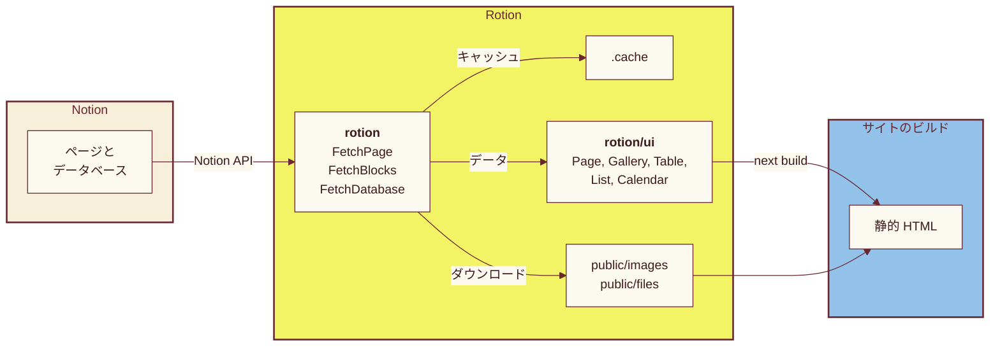

import {
  Action,
  Actions,
  Hero,
  Landing,
  Lede,
  Section,
  Way,
  Ways,
  Tile,
  Wall
} from '@/app/_components/landing.jsx'

<Landing>

<Hero
  lead="Notion の"
  words={['ページ', 'ギャラリー', 'テーブル', 'リスト', 'カレンダー']}
  trail="を、"
  line2="そのままサイトに。"
  labels={{ region: 'Rotion で描画した Notion のページとデータベース', tablist: 'コンポーネント', page: 'ページ', gallery: 'ギャラリー', table: 'テーブル', list: 'リスト', calendar: 'カレンダー' }}
>
  <Lede>
    Rotion は Notion のページとデータベースを React コンポーネントで描画します。
    ギャラリー、テーブル、カレンダー、各種ブロックはスタイル付きで用意されていて、サイトは静的 HTML としてビルドされます。
    この下にあるものは、どれもこのページのビルド時に Notion から取得し、Rotion で描画したものです。
  </Lede>
  <Actions>
  <Action href="/ja/getting-started" primary>はじめる</Action>
  <Action href="/ja/blocks">ブロック一覧を見る</Action>
  </Actions>
</Hero>

<Section
  band="sky"
  title="Notion と同じ見た目で描画するブロック"
  lede="どのタイルも、実際の Notion のページから切り出したものです。開くと、ページ全体が Rotion でどう描画されるかを見られます。"
>

<Wall>
  <Tile id="93997cee371044c2936bb4e911764cd2" from={1} to={4} name="Headings" href="/ja/blocks/headings" />
  <Tile id="38d8251cd03a45bf91613e2ef8a82c48" from={1} to={2} name="Callout" href="/ja/blocks/callout" />
  <Tile id="f882184561d44eed89769bbfb867a6c7" from={1} to={2} name="Image" href="/ja/blocks/image" />
  <Tile id="4d438f5ea4fa43f282153040fe7e1ff5" from={1} to={5} name="To do" href="/ja/blocks/to-do" />
  <Tile id="72fb9fd9ff5247efbe6af4cf151562f5" from={1} to={3} name="Code" href="/ja/blocks/code" />
  <Tile id="348bc8ba092945028865663e981038a9" from={1} to={2} name="Bookmark" href="/ja/blocks/bookmarks" />
  <Tile id="a2af31d8e7254a17883fb6100d7d074a" from={1} to={3} name="Table" href="/ja/blocks/table" />
  <Tile id="038f54d55b684bb0b02f3765dec8f4a9" from={0} to={1} name="Toggle" href="/ja/blocks/toggle" />
  <Tile id="314fffb219c74ffab1e38b890a0de908" from={1} to={2} name="Quote" href="/ja/blocks/quote" />
  <Tile id="1f8ab7d4c3474251b91f04ff70184a2d" from={1} to={2} name="Equation" href="/ja/blocks/equation" />
</Wall>

</Section>

<Section
  title="見た目はサイトに合わせて変えられる"
  lede="コンポーネントはスタイル付きで用意されていて、そのスタイルはどこでも変えられます。変え方は 4 つあります。"
>

<Ways>

<Way title="カスタムプロパティを設定する">

色、フォント、枠線、角の丸み、ギャラリーの列数は、`--rotion-*` のカスタムプロパティです。
`:root` に設定するか、包んでいる要素に設定してサイトの一部だけを変えます。

```css
.blog {
  --rotion-font-family: 'Inter', sans-serif;
  --rotion-primary-text: #3d1a1f;
  --rotion-border-radius: 12px;
  --rotion-gallery-grid-template-columns-medium: repeat(3, 1fr);
}
```

</Way>

<Way title="クラス名で個別にスタイルを当てる">

コンポーネントが描画する要素には、どれも `rotion-` で始まるクラス名が付いています。
カスタムプロパティで変えられない部分も、普通の CSS で変えられます。

```css
.rotion-gallery-card:hover {
  transform: translateY(-2px);
}

.rotion-text-h1 {
  font-family: 'Fraunces', serif;
}
```

</Way>

<Way title="ダークモードの扱いを選ぶ">

`rotion/style.css` は OS の設定に従います。
テーマの切り替えをサイト側で行うときは、代わりに `rotion/style-without-dark.css` を読み込みます。

```ts
// prefers-color-scheme に従う
import 'rotion/style.css'

// ダークモードはサイト側で扱う
import 'rotion/style-without-dark.css'
```

</Way>

<Way title="ビューごとに表示する内容を決める">

表示するプロパティ、各行のリンク先、カードの大きさなどは、props とオプションで指定します。

```tsx
<Gallery
  db={db}
  keys={['Name', 'Tags']}
  options={{
    href: { Name: '/people/[id]' },
    image: { size: 'large', fit: false },
  }}
/>
```

</Way>

</Ways>

<Actions>
  <Action href="/ja/components#theming">テーマのリファレンス</Action>
  <Action href="/ja/database-views">データベースビューのオプション</Action>
</Actions>

</Section>

<Section
  title="Notion のページを HTML にするまで"
  lede="ページを取得し、そのブロックを取得して、Page コンポーネントに渡します。画像とファイルはサイトの中にダウンロードされるので、公開したページが Notion 上のファイルを参照することはありません。"
>



<p className="lp-caption">矢印はデータの流れを表します。</p>

</Section>

<Section
  band="footer"
  title="インストールしてページを描画する"
  lede="パッケージをインストールして NOTION_TOKEN を設定すれば、数行のコードで Notion のページを描画できます。"
>

<div className="lp-stack">

```sh
npm install rotion
```

```tsx filename="app/page.tsx"
import { FetchBlocks, FetchPage } from 'rotion'
import { Page } from 'rotion/ui'

const id = process.env.NOTION_PAGE_ID!

export default async function Home() {
  const page = await FetchPage({
    page_id: id,
    last_edited_time: 'force',
  })
  const blocks = await FetchBlocks({
    block_id: id,
    last_edited_time: page.last_edited_time,
  })
  return <Page blocks={blocks} />
}
```

<Actions>
  <Action href="/ja/getting-started" primary>クイックスタート</Action>
  <Action href="/ja/introduction">Rotion の仕組み</Action>
</Actions>

</div>

</Section>

</Landing>
